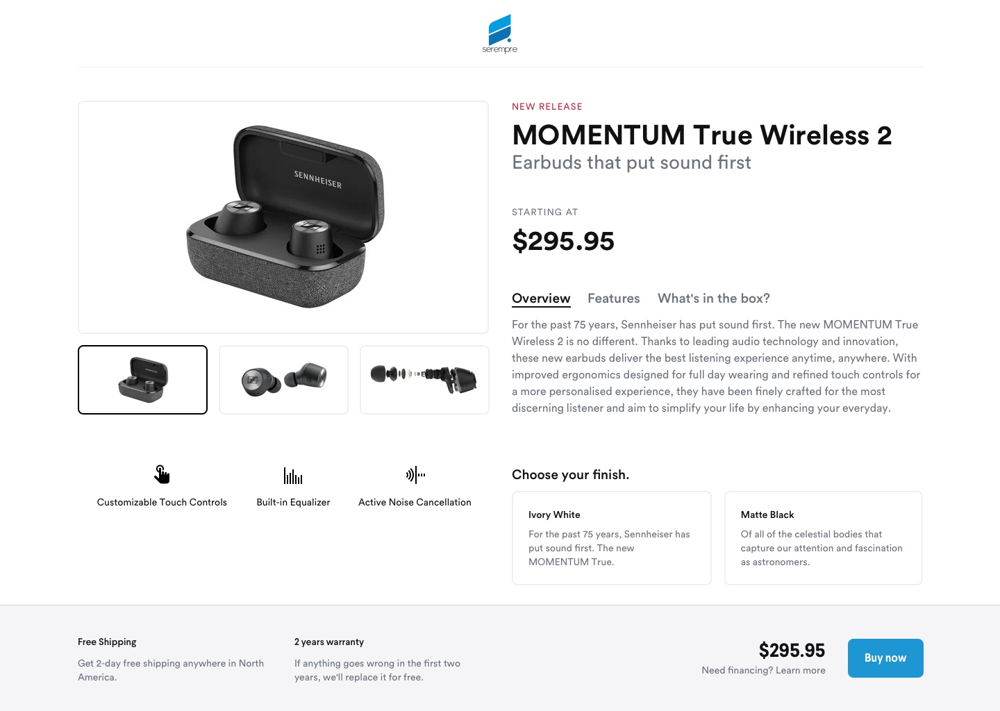

# Prueba Front End para Serempre
Hola! 👋
Nos alegra que hayas llegado hasta este punto y puedas llegar a ser parte del gran equipo humano de Serempre.

### ¿Qué debes hacer? 🧩

Tu tarea consiste en tomar el siguiente diseño y desarrollarlo en JS Vainilla, React, Angular o Vue.

Link del diseño 👉 https://www.sketch.com/s/7f553820-d3b7-443c-86d7-f19bea8dcb89

En el siguiente repositorio vas a encontrar las fuentes necesarias para llevar a cabo la tarea.

### ¿Qué estamos buscando? 🕵️‍♂️

- **Atención al detalle**. El desarrollo debe ser fiel al diseño totalmente. Teniendo en cuenta colores, escala tipográfica, espaciados, altura de línea, etc.
- **Ten en cuenta los diferentes dispositivos**. En el diseño podrás encontrar las respectivas referencias a los breakpoints.
- **Hazla interactiva**. Los usuarios podrán seleccionar entre las diferentes imágenes y ver la previsualización en tiempo real, también podrán explorar las diferentes características (Overview, features, etc..) del producto por medio unas tabs, y el precio total debe mostrar la configuración seleccionada por el usuario en el total ubicado en el footer.
- **Haz tu solución accesible**. Sigue los mejores estándares de accesibilidad, incluyendo navegación por medio del teclado.
- **Crea tus componentes desde cero**. No uses ninguna librería para el carrusel de imágenes, los tabs, etc.
- **Crea los componentes reusables y escalables**. Piensa en la cantidad de desarrolladores que podrían participar en el proyecto así como cuánto podría crecer el mismo.

### A tener en cuenta 👀

* Excelentes prácticas
* Metodologías semánticas y técnicas
* DRY y KISS
* Uso de últimas tecnologías (ES6+, PostCss, Sass, Webpack, etc.)
* Conocimiento de algún framework de JS
* SEO
* Desempeño
* Accesibilidad
* Desarrollo responsive y adaptativo
* Funcionalidad en los navegadores más comunes
* Optimización de recursos y assets
* Proficiencia a la hora de escribir CSS

### Es un plus 🚀

* Escribir test de los componentes
* Resolver problemas desde un enfoque UX / UI
* Uso de TypeScript

### En caso que te animes a correr la milla extra 🏃‍♀️🏃‍♂️

* Agregar animaciones
* Incluir un loading
* Integrar con una plataforma de Back-end

### Para enviar tu solución 🏁

Incluye un `README.md` con una pequeña descripción de tu solución que hable de las cosas interesantes con las que te enfrentaste, decisiones que tomaste, etc.
Cuando termines, crea un repositorio privado en GitHub que solo contenga tu proyecto e invítame al mismo (Soy `fcastillo-serempre`).
Monta el proyecto en una plataforma como Heroku, Netlify, Vercel, etc.

