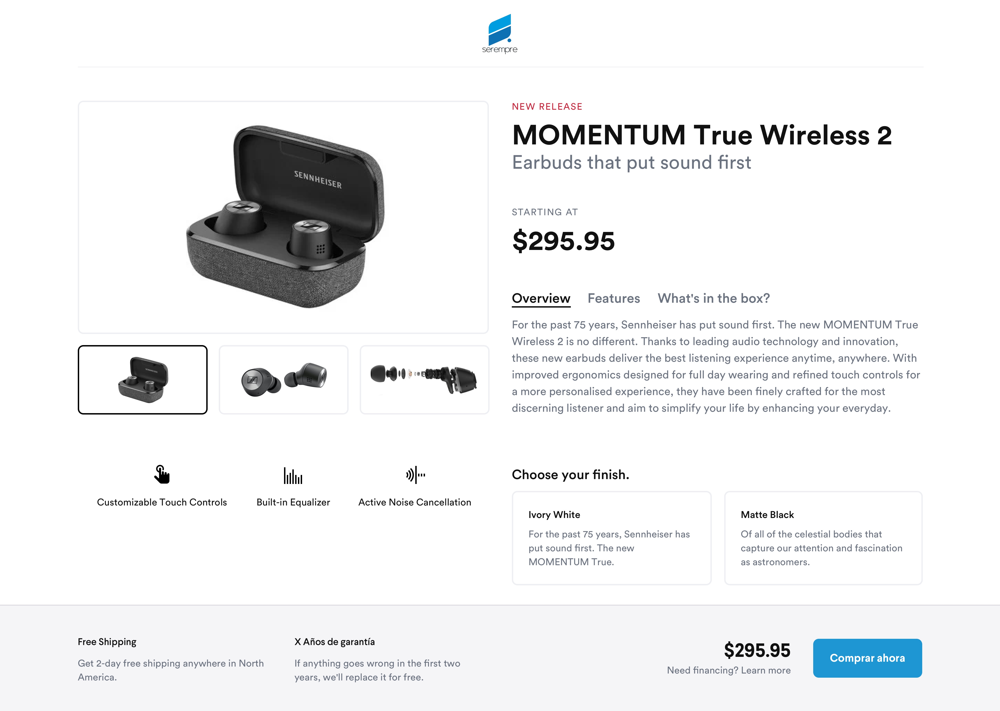

# Prueba de Front-end para Serempre
Hola!
Nos alegra que hayas llegado hasta este punto y puedas llegar a ser parte del gran equipo humano de Serempre.

## ¿Qué debes hacer? 🧩

Link del diseño 👉 https://www.sketch.com/s/e56f2fa2-1281-4229-9744-245e3165cd10/a/g3Kp9r#Inspector

### Funcionalidad de la aplicación 📌
Tu aplicación debe (CRUD):

1. Crear una nueva tarea
2. Ver el detalle de la tarea
3. Editar una tarea.
4. Borrar una tarea.
5. Ver todas las tareas

## ¿Qué vamos a calificar? 🏁
* Excelentes prácticas
* Metodologías semánticas y técnicas
* DRY y KISS
* Uso de últimas tecnologías (ES6+, PostCss, Sass, Webpack, etc.)
* Conocimiento de algún framework de JS
* SEO
* Desempeño
* Accesibilidad
* Desarrollo responsive y adaptativo
* Funcionalidad en los navegadores más comunes
* Optimización de recursos y assets
* Proficiencia a la hora de escribir CSS

## Es un plus 🚀
* Escribir test de los componentes
* Resolver problemas desde un enfoque UX / UI
* Despliegue en una plataforma online (Heroku, Netlify, etc..)
* Uso de TypeScript

## En caso que te animes a correr la milla extra 🏃‍♀️🏃‍♂️
* Agregar animaciones
* Incluir un loading
* Integrar con una plataforma de Back-end
* Utilizar un Gravatar basado en el nombre del usuario

